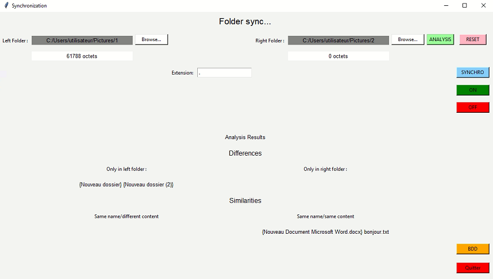

# Sync-app
Application de synchronisation de fichiers en mode unidirectionnel (gauche -> droite)
## Description de l'application
Application graphique codée en python avec Tkinter 
## Fonctionnalités
- Deux options de synchronisation : intégrale ou par filtre d'extension (Bouton __SYNCHRO__)
- Comparaison des deux dossiers selectionnés (Bouton __ANALYSIS__)
- Possibilité de choisir le fonctionnement (comparaison/synchronisation des fichiers) en mode continu (Bouton __ON__/__OFF__)
- Affichage de la base de données associée à une comparaison/synchronisation des fichiers (Bouton __BDD__)
- Réinitialisation de la base de données et des élèments de comparaison (Bouton __RESET__)  

  

## Fonctionnement
La synchronisation s'effectue en se référant au dossier de gauche.  
*Rq* : la synchronisation par extension s'effectue de manière récursive seulement dans le(s) sous-repertoire(s) de droite communs pré-existant(s).  

La base de donnée est constituée des attributs suivants :

| Attribut            | Type          | Indication                     |
| :------------------ | :------------:| :-----------------------------:|
| id                  | INTEGER       |                                |
| nameFile            | TEXT          |                                |
| localisation        | TEXT          | left/right/both                | 
| manipulation        | TEXT          | à créer/à modifier/à supprimer |
| creationDate        | VARCHAR       | format : jjmmaaaa              |
| creationTime        | VARCHAR       | format : hhmmss                | 
| lastModificationDate| VARCHAR       | format : jjmmaaaa              |
| lastModificationTime| VARCHAR       | format : hhmmss                |
| size                | INTEGER       | (en octet)                     | 
| state               | INTEGER       | 0/1 : Non traitée/Traitée      | 


La base de données est générée automatiquement suite aux évenements suivants :
* Bouton __ANALYSIS__: elle affiche pour chaque élèment qui compose les dossiers, leur état actuel ainsi que les manipulations à effectuer pour une eventuelle synchronisation  
*Rq* : si une extension est renseignée, le bouton __BDD__ affichera uniquement les informations des fichiers correspondants à cette extension
* Bouton __SYNCHRO__: elle informe de l'état de l'opération

## Installation
1. Utilisez Python Version 3.9.2
2. Clonez le repo
   ```sh
   git clone https://github.com/apsara-ph/Sync-app.git
   ```
3. Exécutez le fichier appli-sync depuis le dossier Sync-app
   ```sh
   py appli-sync.py
   ```
4. Sélectionnez les dossiers de votre choix puis testez !

## Autheurs
Lucas Enos   
Paul-Henri François  
Pheaktra Thoun  
